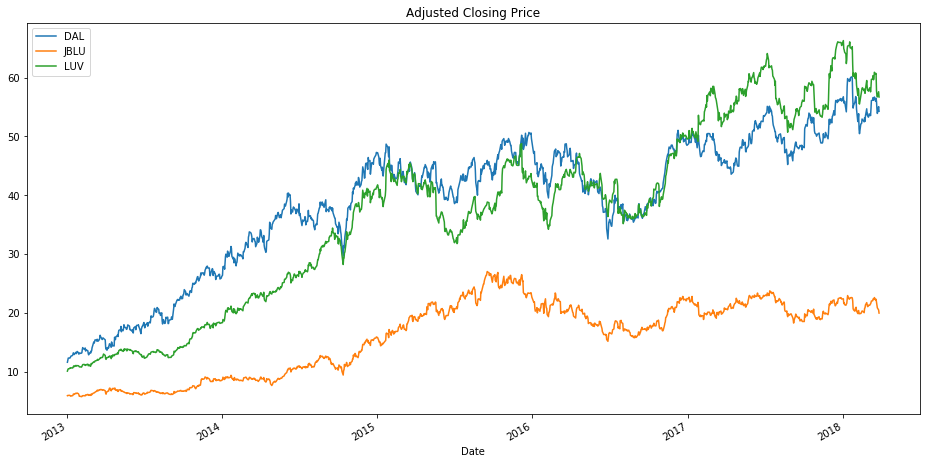
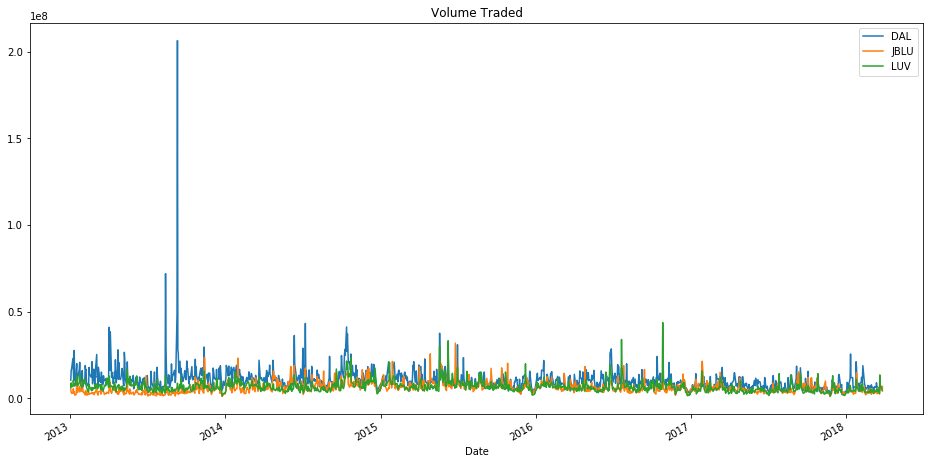
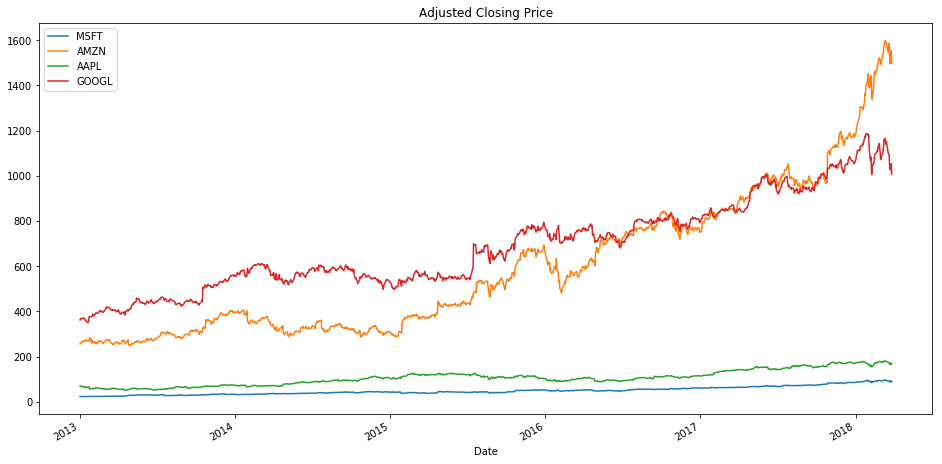
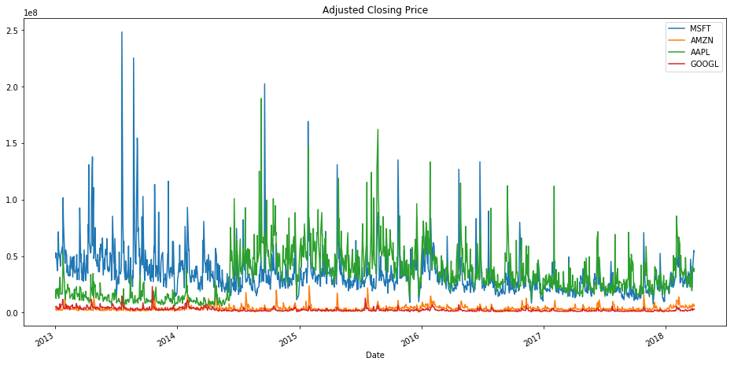

```python
import numpy as np
import pandas as pd
import matplotlib.pyplot as plt
import pandas_datareader
import datetime
import pandas_datareader.data as web
import os
%matploblib inline
# api_key = "s83cqMgYsycyW9fkuMjN"
```

    UsageError: Line magic function `%matploblib` not found.


```python
start = datetime.datetime(2013, 1, 1)
end = datetime.datetime(2018, 10, 10)
```


```python
delta = web.DataReader("DAL", "quandl", start, end)
jb = web.DataReader("JBLU", "quandl", start, end)
sw = web.DataReader("LUV", "quandl", start, end)
```


```python
delta.head()
```


<div>
<style scoped>
    .dataframe tbody tr th:only-of-type {
        vertical-align: middle;
    }

    .dataframe tbody tr th {
        vertical-align: top;
    }

    .dataframe thead th {
        text-align: right;
    }
</style>
<table border="1" class="dataframe">
  <thead>
    <tr style="text-align: right;">
      <th></th>
      <th>Open</th>
      <th>High</th>
      <th>Low</th>
      <th>Close</th>
      <th>Volume</th>
      <th>ExDividend</th>
      <th>SplitRatio</th>
      <th>AdjOpen</th>
      <th>AdjHigh</th>
      <th>AdjLow</th>
      <th>AdjClose</th>
      <th>AdjVolume</th>
    </tr>
    <tr>
      <th>Date</th>
      <th></th>
      <th></th>
      <th></th>
      <th></th>
      <th></th>
      <th></th>
      <th></th>
      <th></th>
      <th></th>
      <th></th>
      <th></th>
      <th></th>
    </tr>
  </thead>
  <tbody>
    <tr>
      <th>2018-03-27</th>
      <td>55.31</td>
      <td>55.475</td>
      <td>53.96</td>
      <td>54.26</td>
      <td>6630294.0</td>
      <td>0.0</td>
      <td>1.0</td>
      <td>55.31</td>
      <td>55.475</td>
      <td>53.96</td>
      <td>54.26</td>
      <td>6630294.0</td>
    </tr>
    <tr>
      <th>2018-03-26</th>
      <td>54.57</td>
      <td>55.275</td>
      <td>54.07</td>
      <td>55.06</td>
      <td>5704464.0</td>
      <td>0.0</td>
      <td>1.0</td>
      <td>54.57</td>
      <td>55.275</td>
      <td>54.07</td>
      <td>55.06</td>
      <td>5704464.0</td>
    </tr>
    <tr>
      <th>2018-03-23</th>
      <td>54.78</td>
      <td>55.210</td>
      <td>53.84</td>
      <td>53.90</td>
      <td>7265632.0</td>
      <td>0.0</td>
      <td>1.0</td>
      <td>54.78</td>
      <td>55.210</td>
      <td>53.84</td>
      <td>53.90</td>
      <td>7265632.0</td>
    </tr>
    <tr>
      <th>2018-03-22</th>
      <td>55.50</td>
      <td>56.000</td>
      <td>54.63</td>
      <td>54.67</td>
      <td>6577056.0</td>
      <td>0.0</td>
      <td>1.0</td>
      <td>55.50</td>
      <td>56.000</td>
      <td>54.63</td>
      <td>54.67</td>
      <td>6577056.0</td>
    </tr>
    <tr>
      <th>2018-03-21</th>
      <td>55.49</td>
      <td>56.360</td>
      <td>54.75</td>
      <td>55.95</td>
      <td>9159784.0</td>
      <td>0.0</td>
      <td>1.0</td>
      <td>55.49</td>
      <td>56.360</td>
      <td>54.75</td>
      <td>55.95</td>
      <td>9159784.0</td>
    </tr>
  </tbody>
</table>
</div>


```python
jb.head()
```


<div>
<style scoped>
    .dataframe tbody tr th:only-of-type {
        vertical-align: middle;
    }

    .dataframe tbody tr th {
        vertical-align: top;
    }

    .dataframe thead th {
        text-align: right;
    }
</style>
<table border="1" class="dataframe">
  <thead>
    <tr style="text-align: right;">
      <th></th>
      <th>Open</th>
      <th>High</th>
      <th>Low</th>
      <th>Close</th>
      <th>Volume</th>
      <th>ExDividend</th>
      <th>SplitRatio</th>
      <th>AdjOpen</th>
      <th>AdjHigh</th>
      <th>AdjLow</th>
      <th>AdjClose</th>
      <th>AdjVolume</th>
    </tr>
    <tr>
      <th>Date</th>
      <th></th>
      <th></th>
      <th></th>
      <th></th>
      <th></th>
      <th></th>
      <th></th>
      <th></th>
      <th></th>
      <th></th>
      <th></th>
      <th></th>
    </tr>
  </thead>
  <tbody>
    <tr>
      <th>2018-03-27</th>
      <td>20.45</td>
      <td>20.48</td>
      <td>19.90</td>
      <td>19.95</td>
      <td>6010105.0</td>
      <td>0.0</td>
      <td>1.0</td>
      <td>20.45</td>
      <td>20.48</td>
      <td>19.90</td>
      <td>19.95</td>
      <td>6010105.0</td>
    </tr>
    <tr>
      <th>2018-03-26</th>
      <td>21.21</td>
      <td>21.21</td>
      <td>20.24</td>
      <td>20.48</td>
      <td>7105065.0</td>
      <td>0.0</td>
      <td>1.0</td>
      <td>21.21</td>
      <td>21.21</td>
      <td>20.24</td>
      <td>20.48</td>
      <td>7105065.0</td>
    </tr>
    <tr>
      <th>2018-03-23</th>
      <td>21.23</td>
      <td>21.41</td>
      <td>20.80</td>
      <td>20.84</td>
      <td>4708783.0</td>
      <td>0.0</td>
      <td>1.0</td>
      <td>21.23</td>
      <td>21.41</td>
      <td>20.80</td>
      <td>20.84</td>
      <td>4708783.0</td>
    </tr>
    <tr>
      <th>2018-03-22</th>
      <td>21.58</td>
      <td>21.87</td>
      <td>21.27</td>
      <td>21.27</td>
      <td>6673678.0</td>
      <td>0.0</td>
      <td>1.0</td>
      <td>21.58</td>
      <td>21.87</td>
      <td>21.27</td>
      <td>21.27</td>
      <td>6673678.0</td>
    </tr>
    <tr>
      <th>2018-03-21</th>
      <td>22.06</td>
      <td>22.12</td>
      <td>21.63</td>
      <td>21.78</td>
      <td>4239384.0</td>
      <td>0.0</td>
      <td>1.0</td>
      <td>22.06</td>
      <td>22.12</td>
      <td>21.63</td>
      <td>21.78</td>
      <td>4239384.0</td>
    </tr>
  </tbody>
</table>
</div>


```python
sw.head()
```


<div>
<style scoped>
    .dataframe tbody tr th:only-of-type {
        vertical-align: middle;
    }

    .dataframe tbody tr th {
        vertical-align: top;
    }

    .dataframe thead th {
        text-align: right;
    }
</style>
<table border="1" class="dataframe">
  <thead>
    <tr style="text-align: right;">
      <th></th>
      <th>Open</th>
      <th>High</th>
      <th>Low</th>
      <th>Close</th>
      <th>Volume</th>
      <th>ExDividend</th>
      <th>SplitRatio</th>
      <th>AdjOpen</th>
      <th>AdjHigh</th>
      <th>AdjLow</th>
      <th>AdjClose</th>
      <th>AdjVolume</th>
    </tr>
    <tr>
      <th>Date</th>
      <th></th>
      <th></th>
      <th></th>
      <th></th>
      <th></th>
      <th></th>
      <th></th>
      <th></th>
      <th></th>
      <th></th>
      <th></th>
      <th></th>
    </tr>
  </thead>
  <tbody>
    <tr>
      <th>2018-03-27</th>
      <td>57.84</td>
      <td>57.95</td>
      <td>56.28</td>
      <td>56.69</td>
      <td>4399779.0</td>
      <td>0.0</td>
      <td>1.0</td>
      <td>57.84</td>
      <td>57.95</td>
      <td>56.28</td>
      <td>56.69</td>
      <td>4399779.0</td>
    </tr>
    <tr>
      <th>2018-03-26</th>
      <td>57.50</td>
      <td>57.86</td>
      <td>56.90</td>
      <td>57.59</td>
      <td>5429307.0</td>
      <td>0.0</td>
      <td>1.0</td>
      <td>57.50</td>
      <td>57.86</td>
      <td>56.90</td>
      <td>57.59</td>
      <td>5429307.0</td>
    </tr>
    <tr>
      <th>2018-03-23</th>
      <td>56.85</td>
      <td>57.97</td>
      <td>56.35</td>
      <td>56.72</td>
      <td>6869027.0</td>
      <td>0.0</td>
      <td>1.0</td>
      <td>56.85</td>
      <td>57.97</td>
      <td>56.35</td>
      <td>56.72</td>
      <td>6869027.0</td>
    </tr>
    <tr>
      <th>2018-03-22</th>
      <td>57.51</td>
      <td>58.27</td>
      <td>56.98</td>
      <td>57.00</td>
      <td>7032066.0</td>
      <td>0.0</td>
      <td>1.0</td>
      <td>57.51</td>
      <td>58.27</td>
      <td>56.98</td>
      <td>57.00</td>
      <td>7032066.0</td>
    </tr>
    <tr>
      <th>2018-03-21</th>
      <td>58.05</td>
      <td>58.40</td>
      <td>56.66</td>
      <td>57.78</td>
      <td>13577027.0</td>
      <td>0.0</td>
      <td>1.0</td>
      <td>58.05</td>
      <td>58.40</td>
      <td>56.66</td>
      <td>57.78</td>
      <td>13577027.0</td>
    </tr>
  </tbody>
</table>
</div>


```python
delta["AdjClose"].plot(label='DAL',figsize=(16,8),title='Adjusted Closing Price')
jb['AdjClose'].plot(label='JBLU')
sw['AdjClose'].plot(label='LUV')
plt.legend();
```





```python
delta['Volume'].plot(label='DAL',figsize=(16,8),title='Volume Traded')
jb['Volume'].plot(label='JBLU')
sw['Volume'].plot(label='LUV')
plt.legend();
```





```python
microsoft = web.DataReader("MSFT", "quandl", start, end)
amazon = web.DataReader("AMZN", "quandl", start, end)
apple = web.DataReader("AAPL", "quandl", start, end)
google_abc = web.DataReader("GOOGL", "quandl", start, end)
```


```python
microsoft.head()
```


<div>
<style scoped>
    .dataframe tbody tr th:only-of-type {
        vertical-align: middle;
    }

    .dataframe tbody tr th {
        vertical-align: top;
    }

    .dataframe thead th {
        text-align: right;
    }
</style>
<table border="1" class="dataframe">
  <thead>
    <tr style="text-align: right;">
      <th></th>
      <th>Open</th>
      <th>High</th>
      <th>Low</th>
      <th>Close</th>
      <th>Volume</th>
      <th>ExDividend</th>
      <th>SplitRatio</th>
      <th>AdjOpen</th>
      <th>AdjHigh</th>
      <th>AdjLow</th>
      <th>AdjClose</th>
      <th>AdjVolume</th>
    </tr>
    <tr>
      <th>Date</th>
      <th></th>
      <th></th>
      <th></th>
      <th></th>
      <th></th>
      <th></th>
      <th></th>
      <th></th>
      <th></th>
      <th></th>
      <th></th>
      <th></th>
    </tr>
  </thead>
  <tbody>
    <tr>
      <th>2018-03-27</th>
      <td>94.940</td>
      <td>95.139</td>
      <td>88.51</td>
      <td>89.47</td>
      <td>53704562.0</td>
      <td>0.0</td>
      <td>1.0</td>
      <td>94.940</td>
      <td>95.139</td>
      <td>88.51</td>
      <td>89.47</td>
      <td>53704562.0</td>
    </tr>
    <tr>
      <th>2018-03-26</th>
      <td>90.610</td>
      <td>94.000</td>
      <td>90.40</td>
      <td>93.78</td>
      <td>55031149.0</td>
      <td>0.0</td>
      <td>1.0</td>
      <td>90.610</td>
      <td>94.000</td>
      <td>90.40</td>
      <td>93.78</td>
      <td>55031149.0</td>
    </tr>
    <tr>
      <th>2018-03-23</th>
      <td>89.500</td>
      <td>90.460</td>
      <td>87.08</td>
      <td>87.18</td>
      <td>42159397.0</td>
      <td>0.0</td>
      <td>1.0</td>
      <td>89.500</td>
      <td>90.460</td>
      <td>87.08</td>
      <td>87.18</td>
      <td>42159397.0</td>
    </tr>
    <tr>
      <th>2018-03-22</th>
      <td>91.265</td>
      <td>91.750</td>
      <td>89.66</td>
      <td>89.79</td>
      <td>37578166.0</td>
      <td>0.0</td>
      <td>1.0</td>
      <td>91.265</td>
      <td>91.750</td>
      <td>89.66</td>
      <td>89.79</td>
      <td>37578166.0</td>
    </tr>
    <tr>
      <th>2018-03-21</th>
      <td>92.930</td>
      <td>94.050</td>
      <td>92.21</td>
      <td>92.48</td>
      <td>23753263.0</td>
      <td>0.0</td>
      <td>1.0</td>
      <td>92.930</td>
      <td>94.050</td>
      <td>92.21</td>
      <td>92.48</td>
      <td>23753263.0</td>
    </tr>
  </tbody>
</table>
</div>


```python
amazon.head()
```


<div>
<style scoped>
    .dataframe tbody tr th:only-of-type {
        vertical-align: middle;
    }

    .dataframe tbody tr th {
        vertical-align: top;
    }

    .dataframe thead th {
        text-align: right;
    }
</style>
<table border="1" class="dataframe">
  <thead>
    <tr style="text-align: right;">
      <th></th>
      <th>Open</th>
      <th>High</th>
      <th>Low</th>
      <th>Close</th>
      <th>Volume</th>
      <th>ExDividend</th>
      <th>SplitRatio</th>
      <th>AdjOpen</th>
      <th>AdjHigh</th>
      <th>AdjLow</th>
      <th>AdjClose</th>
      <th>AdjVolume</th>
    </tr>
    <tr>
      <th>Date</th>
      <th></th>
      <th></th>
      <th></th>
      <th></th>
      <th></th>
      <th></th>
      <th></th>
      <th></th>
      <th></th>
      <th></th>
      <th></th>
      <th></th>
    </tr>
  </thead>
  <tbody>
    <tr>
      <th>2018-03-27</th>
      <td>1572.40</td>
      <td>1575.96</td>
      <td>1482.32</td>
      <td>1497.05</td>
      <td>6793279.0</td>
      <td>0.0</td>
      <td>1.0</td>
      <td>1572.40</td>
      <td>1575.96</td>
      <td>1482.32</td>
      <td>1497.05</td>
      <td>6793279.0</td>
    </tr>
    <tr>
      <th>2018-03-26</th>
      <td>1530.00</td>
      <td>1556.99</td>
      <td>1499.25</td>
      <td>1555.86</td>
      <td>5547618.0</td>
      <td>0.0</td>
      <td>1.0</td>
      <td>1530.00</td>
      <td>1556.99</td>
      <td>1499.25</td>
      <td>1555.86</td>
      <td>5547618.0</td>
    </tr>
    <tr>
      <th>2018-03-23</th>
      <td>1539.01</td>
      <td>1549.02</td>
      <td>1495.36</td>
      <td>1495.56</td>
      <td>7843966.0</td>
      <td>0.0</td>
      <td>1.0</td>
      <td>1539.01</td>
      <td>1549.02</td>
      <td>1495.36</td>
      <td>1495.56</td>
      <td>7843966.0</td>
    </tr>
    <tr>
      <th>2018-03-22</th>
      <td>1565.47</td>
      <td>1573.85</td>
      <td>1542.40</td>
      <td>1544.10</td>
      <td>6177737.0</td>
      <td>0.0</td>
      <td>1.0</td>
      <td>1565.47</td>
      <td>1573.85</td>
      <td>1542.40</td>
      <td>1544.10</td>
      <td>6177737.0</td>
    </tr>
    <tr>
      <th>2018-03-21</th>
      <td>1586.45</td>
      <td>1590.00</td>
      <td>1563.17</td>
      <td>1581.86</td>
      <td>4667291.0</td>
      <td>0.0</td>
      <td>1.0</td>
      <td>1586.45</td>
      <td>1590.00</td>
      <td>1563.17</td>
      <td>1581.86</td>
      <td>4667291.0</td>
    </tr>
  </tbody>
</table>
</div>


```python
apple.head()
```


<div>
<style scoped>
    .dataframe tbody tr th:only-of-type {
        vertical-align: middle;
    }

    .dataframe tbody tr th {
        vertical-align: top;
    }

    .dataframe thead th {
        text-align: right;
    }
</style>
<table border="1" class="dataframe">
  <thead>
    <tr style="text-align: right;">
      <th></th>
      <th>Open</th>
      <th>High</th>
      <th>Low</th>
      <th>Close</th>
      <th>Volume</th>
      <th>ExDividend</th>
      <th>SplitRatio</th>
      <th>AdjOpen</th>
      <th>AdjHigh</th>
      <th>AdjLow</th>
      <th>AdjClose</th>
      <th>AdjVolume</th>
    </tr>
    <tr>
      <th>Date</th>
      <th></th>
      <th></th>
      <th></th>
      <th></th>
      <th></th>
      <th></th>
      <th></th>
      <th></th>
      <th></th>
      <th></th>
      <th></th>
      <th></th>
    </tr>
  </thead>
  <tbody>
    <tr>
      <th>2018-03-27</th>
      <td>173.68</td>
      <td>175.15</td>
      <td>166.92</td>
      <td>168.340</td>
      <td>38962839.0</td>
      <td>0.0</td>
      <td>1.0</td>
      <td>173.68</td>
      <td>175.15</td>
      <td>166.92</td>
      <td>168.340</td>
      <td>38962839.0</td>
    </tr>
    <tr>
      <th>2018-03-26</th>
      <td>168.07</td>
      <td>173.10</td>
      <td>166.44</td>
      <td>172.770</td>
      <td>36272617.0</td>
      <td>0.0</td>
      <td>1.0</td>
      <td>168.07</td>
      <td>173.10</td>
      <td>166.44</td>
      <td>172.770</td>
      <td>36272617.0</td>
    </tr>
    <tr>
      <th>2018-03-23</th>
      <td>168.39</td>
      <td>169.92</td>
      <td>164.94</td>
      <td>164.940</td>
      <td>40248954.0</td>
      <td>0.0</td>
      <td>1.0</td>
      <td>168.39</td>
      <td>169.92</td>
      <td>164.94</td>
      <td>164.940</td>
      <td>40248954.0</td>
    </tr>
    <tr>
      <th>2018-03-22</th>
      <td>170.00</td>
      <td>172.68</td>
      <td>168.60</td>
      <td>168.845</td>
      <td>41051076.0</td>
      <td>0.0</td>
      <td>1.0</td>
      <td>170.00</td>
      <td>172.68</td>
      <td>168.60</td>
      <td>168.845</td>
      <td>41051076.0</td>
    </tr>
    <tr>
      <th>2018-03-21</th>
      <td>175.04</td>
      <td>175.09</td>
      <td>171.26</td>
      <td>171.270</td>
      <td>35247358.0</td>
      <td>0.0</td>
      <td>1.0</td>
      <td>175.04</td>
      <td>175.09</td>
      <td>171.26</td>
      <td>171.270</td>
      <td>35247358.0</td>
    </tr>
  </tbody>
</table>
</div>


```python
google_abc.head()
```


<div>
<style scoped>
    .dataframe tbody tr th:only-of-type {
        vertical-align: middle;
    }

    .dataframe tbody tr th {
        vertical-align: top;
    }

    .dataframe thead th {
        text-align: right;
    }
</style>
<table border="1" class="dataframe">
  <thead>
    <tr style="text-align: right;">
      <th></th>
      <th>Open</th>
      <th>High</th>
      <th>Low</th>
      <th>Close</th>
      <th>Volume</th>
      <th>ExDividend</th>
      <th>SplitRatio</th>
      <th>AdjOpen</th>
      <th>AdjHigh</th>
      <th>AdjLow</th>
      <th>AdjClose</th>
      <th>AdjVolume</th>
    </tr>
    <tr>
      <th>Date</th>
      <th></th>
      <th></th>
      <th></th>
      <th></th>
      <th></th>
      <th></th>
      <th></th>
      <th></th>
      <th></th>
      <th></th>
      <th></th>
      <th></th>
    </tr>
  </thead>
  <tbody>
    <tr>
      <th>2018-03-27</th>
      <td>1063.90</td>
      <td>1064.54</td>
      <td>997.62</td>
      <td>1006.94</td>
      <td>2940957.0</td>
      <td>0.0</td>
      <td>1.0</td>
      <td>1063.90</td>
      <td>1064.54</td>
      <td>997.62</td>
      <td>1006.94</td>
      <td>2940957.0</td>
    </tr>
    <tr>
      <th>2018-03-26</th>
      <td>1050.60</td>
      <td>1059.27</td>
      <td>1010.58</td>
      <td>1054.09</td>
      <td>3272409.0</td>
      <td>0.0</td>
      <td>1.0</td>
      <td>1050.60</td>
      <td>1059.27</td>
      <td>1010.58</td>
      <td>1054.09</td>
      <td>3272409.0</td>
    </tr>
    <tr>
      <th>2018-03-23</th>
      <td>1051.37</td>
      <td>1066.78</td>
      <td>1024.87</td>
      <td>1026.55</td>
      <td>2413517.0</td>
      <td>0.0</td>
      <td>1.0</td>
      <td>1051.37</td>
      <td>1066.78</td>
      <td>1024.87</td>
      <td>1026.55</td>
      <td>2413517.0</td>
    </tr>
    <tr>
      <th>2018-03-22</th>
      <td>1080.01</td>
      <td>1083.92</td>
      <td>1049.64</td>
      <td>1053.15</td>
      <td>3418154.0</td>
      <td>0.0</td>
      <td>1.0</td>
      <td>1080.01</td>
      <td>1083.92</td>
      <td>1049.64</td>
      <td>1053.15</td>
      <td>3418154.0</td>
    </tr>
    <tr>
      <th>2018-03-21</th>
      <td>1092.57</td>
      <td>1108.70</td>
      <td>1087.21</td>
      <td>1094.00</td>
      <td>1990515.0</td>
      <td>0.0</td>
      <td>1.0</td>
      <td>1092.57</td>
      <td>1108.70</td>
      <td>1087.21</td>
      <td>1094.00</td>
      <td>1990515.0</td>
    </tr>
  </tbody>
</table>
</div>


```python
microsoft["AdjClose"].plot(label='MSFT',figsize=(16,8),title='Adjusted Closing Price')
amazon['AdjClose'].plot(label='AMZN')
apple['AdjClose'].plot(label='AAPL')
google_abc['AdjClose'].plot(label='GOOGL')
plt.legend();
```





```python
microsoft["Volume"].plot(label='MSFT',figsize=(16,8),title='Adjusted Closing Price')
amazon['Volume'].plot(label='AMZN')
apple['Volume'].plot(label='AAPL')
google_abc['Volume'].plot(label='GOOGL')
plt.legend();
```




